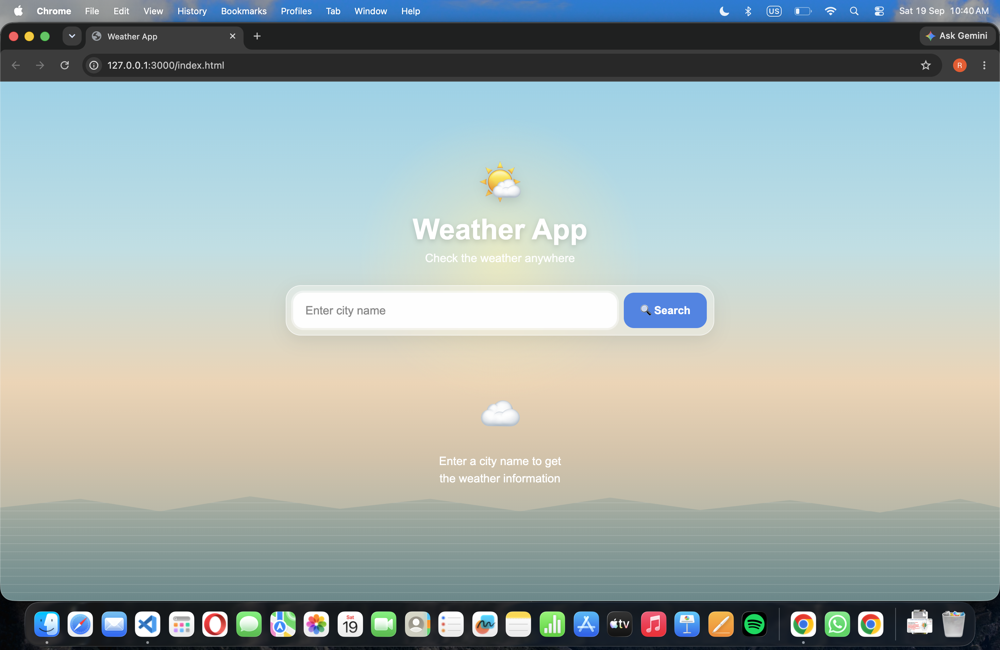
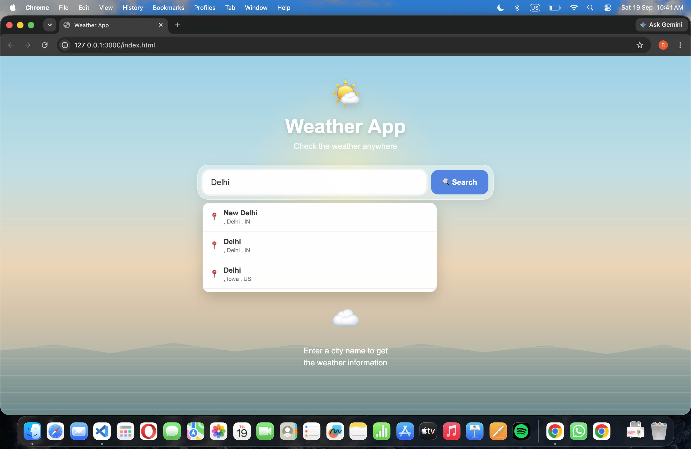
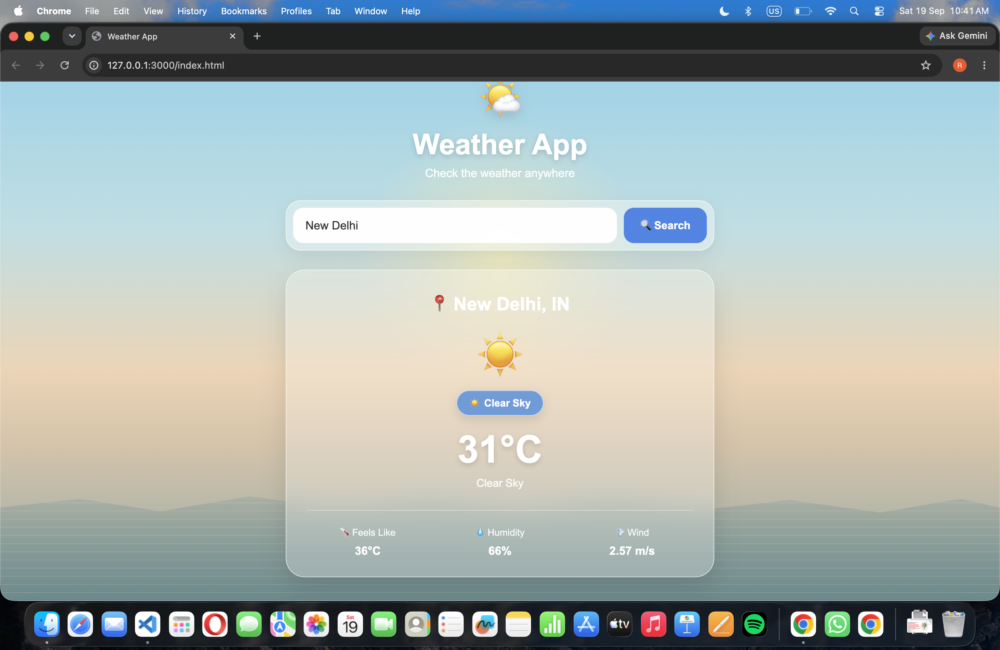
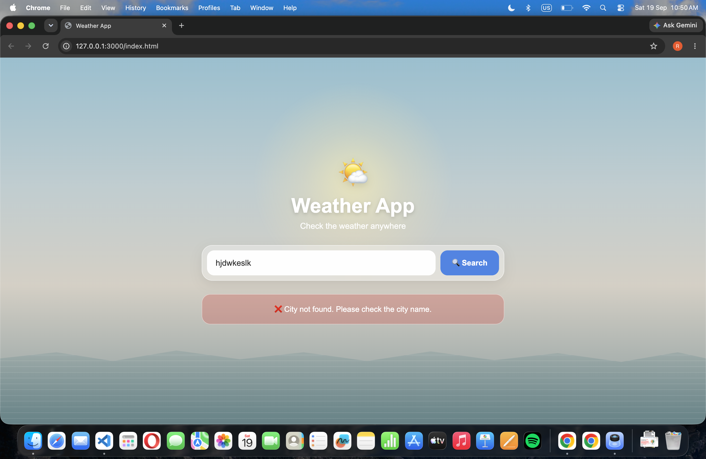
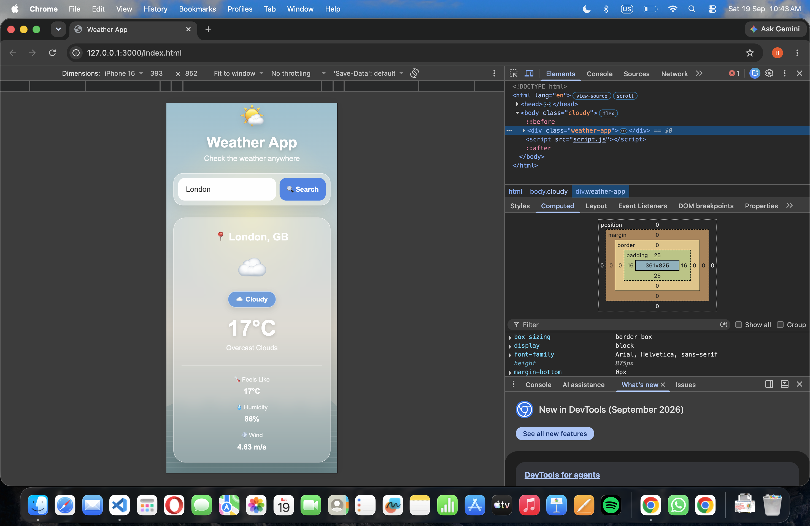

# 🌤️ Weather Website

A responsive and user-friendly Weather Website built using HTML, CSS, and JavaScript. The application allows users to search for a city and view its current weather information using real-time data from the OpenWeather API.

## 🌍 Live Preview

## 🌐 Live Preview

[View Live Weather App](https://riya-weather-app.vercel.app/)

## 📌 About the Project

This project was created to practice and strengthen my frontend development and JavaScript skills by building a real-world application.

The Weather Website takes a city name as input, sends a request to the OpenWeather API, processes the returned weather data, and displays the relevant information through a clean and responsive interface.

The project helped me understand how frontend applications interact with external APIs and how JavaScript can be used to dynamically update a webpage based on user input.

## ✨ Features

* 🔍 Search weather by city name
* 🌡️ Display current temperature
* 🌤️ Display current weather condition
* 💧 Display humidity
* 💨 Display wind information
* 🌎 Fetch real-time weather data
* ❌ Handles invalid city searches
* 📱 Responsive user interface
* 🎨 Custom weather-themed UI
* ⚡ Dynamic content updates using JavaScript

## 🛠️ Technologies Used

* HTML5 – Structure of the website
* CSS3 – Styling, layout, responsiveness, and animations
* JavaScript – Application logic and API handling
* OpenWeather API – Real-time weather data
* VS Code – Development environment

## 🔄 How It Works

User enters city
       ↓
JavaScript reads the input
       ↓
Request sent to OpenWeather API
       ↓
Weather data received
       ↓
JavaScript processes the response
       ↓
Weather information displayed on the website

## 📸 Screenshots

### 🏠 Home Page

### 🔍 City Search Suggestions

### 🌦️ Weather Search Result

### ❌ Error Handling

### 📱 Responsive Design

## 🔑 API

This project uses the OpenWeather API to retrieve weather information.

The API provides information such as:

* Temperature
* Weather condition
* Humidity
* Wind speed
* City information

## 📚 What I Learned

Through this project, I practiced:

* Working with APIs
* Using JavaScript `fetch()`
* Handling asynchronous operations
* Working with JSON responses
* DOM manipulation
* Handling user input
* Error handling
* Updating webpage content dynamically
* Creating responsive layouts
* Structuring a frontend project

## 🔮 Future Improvements

Some features I would like to add in the future:

* 📍 Detect weather using the user's location
* 🌙 Dark/light weather themes
* 📅 Multi-day weather forecast
* 🌡️ Additional weather details
* 🌍 Weather search history
* 📱 Further mobile optimization
* 🎨 Dynamic backgrounds based on weather conditions

## 👩‍💻 Author

Riya Panchal

B.Tech Information Technology Student

Interested in **Frontend Development, JavaScript, React, and Software Development**.

## ⭐ Feedback

If you find this project useful or have suggestions for improvement, feel free to explore the repository and share your feedback.
